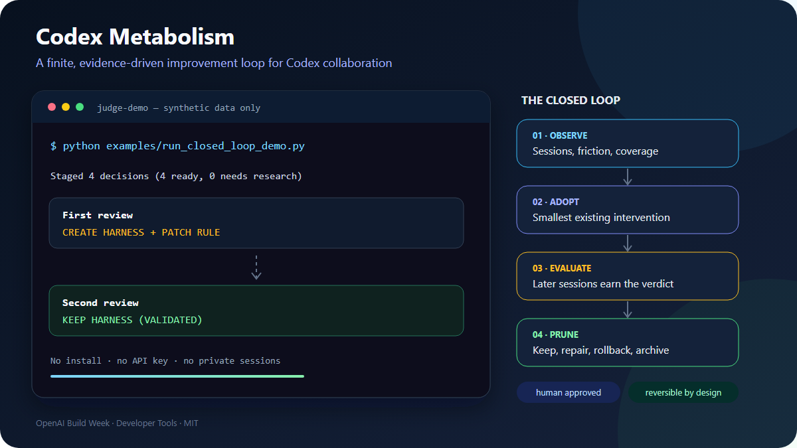

# Codex Metabolism

> An evidence-driven collaboration metabolism layer for Codex: observe recurring friction, adopt or create the smallest useful intervention, evaluate it on later sessions, and prune what no longer helps.

[繁體中文](README.zh-TW.md) · OpenAI Build Week track: **Developer Tools**

## Judge quick start — under 60 seconds

Requirements: Python 3.11 or newer. No installation, API key, Codex login, or personal session data is required.

```bash
git clone https://github.com/shihchengwei-lab/codex-metabolism.git
cd codex-metabolism
python examples/run_closed_loop_demo.py
```

Expected proof of the two-generation loop:

```text
First review: CREATE HARNESS + PATCH RULE
Second review: KEEP HARNESS (VALIDATED)
```

The command copies synthetic fixtures into an isolated retained temporary directory, applies only to that copy, and prints the artifact path for inspection. It neither reads nor changes real Codex sessions, skills, hooks, or `AGENTS.md` files.



[Editable SVG source](docs/assets/judge-demo.svg)

## Who it is for

Codex Metabolism is for developers and teams whose Codex setup accumulates rules, skills, hooks, scripts, and tools faster than anyone can evaluate them. It turns repeated collaboration friction into a finite, evidence-backed maintenance loop instead of another ever-growing memory layer.

## How Codex and GPT-5.6 built this

### Codex and GPT-5.6 contributions

The primary build thread used Codex with GPT-5.6 to inspect real local JSONL variants, separate hard signals from inference, search for existing open-source components before building, write failing tests for each implementation slice, and close the receipt/evaluation/rollback loop. The required `/feedback` Session ID for that thread will be supplied directly in the Devpost submission.

### Human product decisions

The human collaborator chose the product boundaries: expand metabolism beyond skills, prefer mechanical safeguards over more prose, search installed and external tools before creating anything, cap managed rules, preserve human-owned `AGENTS.md` content, use synthetic public data, and require explicit approval at every mutation boundary.

### Runtime boundary

The deterministic judge demo intentionally makes no model call. It proves the closed loop reproducibly with synthetic fixtures. The separate `--advisor codex` option can request a bounded GPT-5.6 second opinion through the user's existing Codex authentication, but that advice is non-authoritative and cannot bypass deterministic safety gates.

See [the Devpost submission draft](docs/DEVPOST.md) and [the English video production pack](docs/DEMO_VIDEO.md) for the build story and demo plan.

Codex Metabolism does not update model weights. It maintains the procedural environment around Codex across four intervention layers:

- `HARNESS`: hooks, tests, scripts, config, permissions, and other mechanical safeguards.
- `TOOL`: installed capabilities, plugins, CLIs, and reviewed open-source projects.
- `SKILL`: reusable contextual workflows.
- `RULE`: durable guidance in `AGENTS.md`.

## The closed loop

```text
Codex collaboration sessions
          |
          v
observe evidence + parser coverage + current intervention receipts
          |
          v
necessity -> Codex built-in -> installed -> repo -> external ecosystem
          |
          v
CREATE / PATCH / KEEP / RETIRE_CANDIDATE
          |
          v
stage evidence + artifact or bounded recommendation
          |
          v
explicit human approval
          |
          v
future sessions -> VALIDATED / INEFFECTIVE / IDLE_CANDIDATE
          |
          +--------------------------> keep / repair / rollback / archive
```

An active intervention suppresses a duplicate creation proposal. Two later matching successes can validate it; two later matching failures nominate a patch; at least 28 days and ten later sessions without a matching opportunity can only produce a low-confidence retirement candidate. Silence is never treated as proof of quality.

## Public deterministic demo

Requirements: Python 3.11 or newer. The core has no third-party runtime dependencies.

```powershell
python -m codex_metabolism review --days 7 `
  --codex-home examples/demo-home/.codex `
  --skill-root examples/demo-home/.agents/skills `
  --project-root examples/demo-project `
  --catalog-file examples/reviewed-catalog.json `
  --skillreaper-report examples/skillreaper-report.json `
  --output-dir .demo-review `
  --now 2026-07-20T12:00:00+00:00
```

Bash/zsh equivalent:

```bash
python -m codex_metabolism review --days 7 \
  --codex-home examples/demo-home/.codex \
  --skill-root examples/demo-home/.agents/skills \
  --project-root examples/demo-project \
  --catalog-file examples/reviewed-catalog.json \
  --skillreaper-report examples/skillreaper-report.json \
  --output-dir .demo-review \
  --now 2026-07-20T12:00:00+00:00
```

Expected result:

```text
Staged 4 decisions (4 ready, 0 needs research) at .demo-review
```

The synthetic, private-data-free scenario produces:

- `CREATE HARNESS`: stage a narrow `PreToolUse` guard for repeated deployment friction.
- `PATCH RULE`: evaluate the entire demo `AGENTS.md`, stage a managed-region-only diff, and leave human-owned content untouched.
- `KEEP SKILL`: retain `healthy-skill` from positive SkillReaper evidence.
- `RETIRE_CANDIDATE SKILL`: nominate `old-unused` from complete lifecycle evidence; review moves or deletes nothing.

Open `.demo-review/report.md`, `decisions.json`, and the proposal directories to inspect the evidence and diffs.

To replay the actual two-generation loop in an isolated retained temporary directory, run:

```powershell
python examples/run_closed_loop_demo.py
```

It performs the first review, applies the staged harness and managed-region patch only inside the copied demo project, records the explicit hook-trust confirmation step, adds two later successful synthetic sessions, and runs review again. The final output must include `Second review: KEEP HARNESS (VALIDATED)`. Because this is an isolated synthetic replay, it does not alter Codex's real hook trust store.

## Install and review local history

```powershell
python -m venv .venv
.venv\Scripts\Activate.ps1
python -m pip install -e .
codex-metabolism review --days 7 --search-oss
```

On macOS or Linux, activate with `source .venv/bin/activate`.

By default, review scans recent `~/.codex/sessions/`, installed skills, the current repository's mechanical assets, and active `AGENTS.md` scopes. It writes staged output only under `.codex-metabolism/`:

```text
.codex-metabolism/
├── report.md
├── decisions.json
├── interventions.jsonl
├── proposed-adoptions/
├── proposed-harness/
├── proposed-rules/
└── proposed-skills/
```

Reuse the same output directory across reviews. `interventions.jsonl` is the local receipt ledger that connects an approved change to later session evidence.

## `AGENTS.md` ownership boundary

Codex Metabolism inventories and evaluates the whole active `AGENTS.md` portfolio: user, project, and nested scopes. It reports the file hash, size, line count, estimated directive count, duplicate guidance, recurrent friction despite guidance, and context-budget pressure.

Only a pre-existing, valid managed region is machine-editable:

```markdown
<!-- codex-metabolism:managed-start -->
- Keep this managed rules list bounded.
<!-- codex-metabolism:managed-end -->
```

The boundary is strict:

- Review never modifies a live file.
- An approved `apply` may replace only bytes between one valid marker pair.
- Everything outside the markers is recommendation-only.
- The full-file SHA-256 must still match the reviewed version.
- Missing, duplicate, nested, non-standalone, or reordered markers disable direct apply.
- The managed region has a maximum of ten rule directives; each new-rule proposal is bounded to three recommendations.
- If no managed region exists, the tool suggests adding one but does not insert it.
- Managed-region changes have receipts and can be rolled back.

This uses Codex's real filename, `AGENTS.md`, and follows its user, repository, and nested-scope model. See the official [Codex `AGENTS.md` documentation](https://learn.chatgpt.com/docs/agent-configuration/agents-md).

## Human approval commands

Review the staged evidence and exact artifact before running a lifecycle command.

```powershell
# Apply a staged harness, skill patch, or valid AGENTS.md managed-region patch
codex-metabolism apply <decision-id> --project-root .

# Project hooks remain pending until you review/trust them with Codex `/hooks`;
# then explicitly begin evidence evaluation
codex-metabolism activate-harness <decision-id> --confirmed-trusted

# Revert an active harness, skill change, or managed-region change
codex-metabolism rollback <original-decision-id> --project-root .

# Archive and restore a skill retirement candidate
codex-metabolism archive <decision-id>
codex-metabolism restore <original-decision-id>

# After manually reviewing and installing an external tool, start evaluation
codex-metabolism activate-tool <decision-id> --artifact <existing-path-or-command>

# After manually disabling or uninstalling an idle external tool, record retirement
codex-metabolism retire-tool <retirement-decision-id> --confirmed-inactive

codex-metabolism reject <decision-id>
```

External projects are never downloaded, executed, installed, disabled, or deleted by Codex Metabolism. `activate-tool` verifies an existing artifact and records it; `retire-tool` records the user's confirmed action while leaving the artifact untouched.

New or changed Codex project hooks are also not assumed active merely because files were written. `apply` records them as `PENDING_TRUST`; after the user reviews and trusts the hook with Codex `/hooks`, `activate-harness` changes the receipt to `ACTIVE`. This mirrors the official [Codex hooks trust flow](https://learn.chatgpt.com/docs/hooks#review-and-trust-hooks).

## The adoption ladder

Every creation proposal records five rungs:

1. **Necessity** — did the same problem recur in at least two sessions with a verifiable recovery?
2. **Codex built-in** — can a native hook, skill, config, or other supported capability solve it?
3. **Installed** — is a suitable tool, plugin, skill, or dependency already present?
4. **Repository** — is there an existing hook, test, script, config, or harness to extend?
5. **Ecosystem** — is there a reviewed open-source tool to adopt before building another one?

If the ecosystem rung is unchecked, a new `CREATE` remains `needs_research` and no applyable artifact is staged. `--search-oss` sends only sanitized, allowlisted keywords to GitHub public repository search—not session text, prompts, paths, credentials, or arbitrary command arguments.

## Existing tools are components

- [SkillReaper](https://github.com/thousandflowers/skillreaper) supplies complete skill lifecycle evidence. Without it, positive local evidence can produce `KEEP`, but missing observations cannot produce retirement.
- [codlogs](https://github.com/tobitege/codlogs) was evaluated as a mature read-only session explorer. The MVP keeps a zero-dependency streaming parser behind an adapter-shaped observation layer.
- [Hermes Agent](https://github.com/NousResearch/hermes-agent) and [Hermes Curator Evolver](https://github.com/pingchesu/hermes-curator-evolver) inspired agent-managed skill generation and evidence-gated evolution. Their code is not vendored.

## Optional GPT-5.6 second opinion

The deterministic router remains authoritative:

```powershell
codex-metabolism review --days 7 --search-oss --advisor codex
```

This explicit option starts an ephemeral `codex exec` run in a read-only sandbox with a strict output schema. It supports all four target layers, cites only supplied evidence IDs, cannot bypass an incomplete adoption ladder or the mechanical-first invariant, and stores its output as non-authoritative metadata.

Privacy boundary: the option sends bounded decision and evidence summaries—including relevant command and correction excerpts—to OpenAI using the user's Codex authentication. It is off by default.

## Evidence and safety contract

- JSONL is parsed line by line, with bounded excerpts instead of entire transcripts.
- Coverage is a first-class output. Parse failure means “unknown,” never “unused.”
- Exit status and tests are hard signals; user corrections and inferred outcomes are weaker signals.
- Skill invocation remains heuristic because inspected Codex JSONL versions did not expose a stable structured invocation event.
- Review is stage-only; mutation requires one explicitly approved decision ID.
- Skill patches and `AGENTS.md` changes are hash-gated against the reviewed live file.
- Retirement is a candidate until a person approves it; skills are archived, never deleted.
- The sample pre-tool guard only checks command order within one shell invocation. It is not a general policy engine.

## Development and verification

```powershell
python -m unittest discover -s tests -v
# Optional, when pytest is installed: python -m pytest -q
python -m build
```

The test suite covers JSONL variants and malformed input, parser coverage, adoption-ladder routing, external-tool privacy, SkillReaper import, whole-file `AGENTS.md` review, managed-region byte preservation, staging, hash-gated apply, future-session evaluation, duplicate suppression, rollback, skill archive/restore, manual external-tool activation/retirement, and the structured advisor.

## Supported platforms

- **Windows, Python 3.12:** verified in this checkout and again from a clean public clone.
- **macOS/Linux, Python 3.11+:** designed for standard-library portability, not yet verified by this project team.

## License

MIT. External projects retain their own licenses and are not vendored here.
