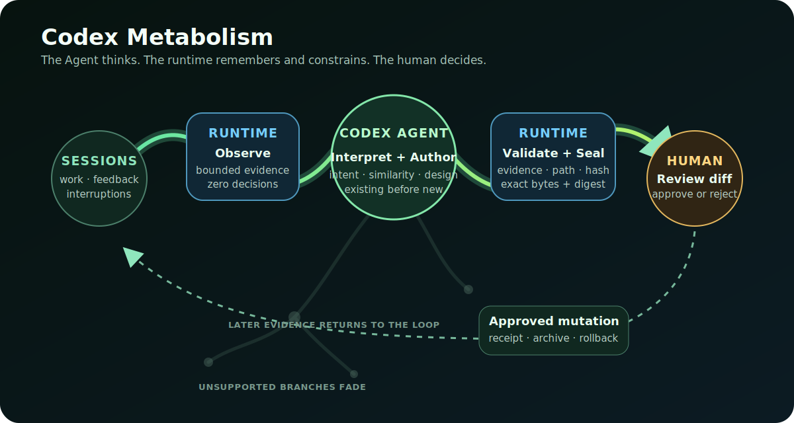

# Codex Metabolism

> **Agent 負責思考；runtime 負責記住與約束。**

[English](README.md) · OpenAI Build Week：**Developer Tools** · [MIT](LICENSE)

[](https://github.com/shihchengwei-lab/codex-metabolism/actions/workflows/ci.yml)

Codex 很會解決眼前的任務，但協作久了，環境會堆滿 skills、規則、scripts、hooks 與一次性補丁。有用的路徑愈來愈難找，過時的路徑一直留下，同一個人類修正也可能在另一個 session 再次出現。

**Codex Metabolism 是改善這個協作層的 Agent Skill。**目前正在工作的 Codex 讀取近期 session 的有限證據，辨認可重用工作與反覆摩擦，先找既有能力，再寫出最小的改善方案。零第三方相依的 Python runtime 保存證據與可收斂的 target 歷史、把批准綁定到確切版本，並只直接管理它能安全回復的 Skill 變更。

**Codex 負責語義理解與產物設計；runtime 負責證據邊界、持久化與安全變更；人類負責最後的 gate。**

## 為什麼還需要一個程式？

程式沒有取代 AI 的理解能力。它替 Agent 移除三種不該每次臨時重做的麻煩：

- **跨 session 的眼睛：**把持續變動的 JSONL log 整理成有限、保序、經遮蔽的證據膠囊；解析缺口仍保持 unknown。
- **持久帳本：**跨 session 保存每個 target 的理由、預期效果、撤回條件、證據與狀態歷史。
- **不越權的手：**拒絕虛構證據、路徑逃逸、過期目標與審核後被偷換的 artifact；採 atomic write 並保留 rollback copy。

沒有 Agent，runtime 無法判斷兩段用詞不同的協作其實是同一個問題。沒有 runtime，Agent 每次都得重新處理 raw log、可變檔案、provenance 與 rollback。兩者合起來才是產品。

## 使用方式

需要 Python 3.11+ 與 Codex。

```powershell
git clone https://github.com/shihchengwei-lab/codex-metabolism "$HOME/.codex/skills/codex-metabolism"
python -m pip install -e "$HOME/.codex/skills/codex-metabolism"
```

Clone 到 Codex skills 目錄是在安裝產品入口；`pip` 則安裝 runtime command。只安裝 Python wheel 會得到基礎層，不會讓 Codex 自動發現 skill。

重新啟動 Codex 讓它發現 skill，接著直接說：

```text
請用 $codex-metabolism review 我最近 7 天的協作。
找出可重用的成功流程與反覆摩擦；新建前先找既有能力；
顯示每一個 proposed diff，在我批准前不要套用。
```

Codex 會：

1. 執行 `codex-metabolism observe`，準備不帶判斷的中性證據；
2. 自己理解任務意圖、feedback、interruptions、工具軌跡與目前 portfolio；
3. 依序檢查 Codex 內建、已安裝能力、repo 資產與相關外部工具；
4. 寫出零到三個 evidence-linked proposals 與完整 artifacts；
5. 執行 `codex-metabolism stage` 驗證並封存 exact bytes；
6. 顯示證據、不確定性、預期效果、回滾條件、完整 diff 與 approval digest；
7. 等人類明確批准後才改 live state。

第一次由使用者主動 review 後，Skill 會提供一次可選提醒：建議在你的**每週用量重置**前建立 Codex 原生 **Scheduled task**。工具無法可靠推測每個帳號的重置時間，因此由你提供時間。排程只能準備與 stage review，不能 apply、record、退休、commit 或 push；結果留在 Scheduled inbox，等待之後的互動式人工決定。完整 prompt 見 [stage-only 排程範本](references/scheduled-review.md)。

## 代謝迴圈

```text
近期 sessions + 協作 portfolio
              |
              v
       runtime 準備中性證據
              |
              v
       Codex 理解並設計 artifact
              |
              v
    runtime 驗證引用並封存 exact bytes
              |
              v
          人類審查 diff
              |
              v
       核准 apply / record / archive
              |
              v
         receipt 進入下次 review ----+
              ^                       |
              +--- 保留 / 修補 / 回滾
```

這就是黏菌比喻的用途：下一輪會同時看見新證據與原本的成功／撤回條件，讓 Codex 與人類決定強化、修補或退休同一條路，而不是再疊一條。**別人持續做加法；Metabolism 加入選擇、驗證與減法。**



## 60 秒隔離 demo

不需要 API key、Codex 登入或私人 session：

```bash
python examples/run_agent_first_demo.py
```

Demo 使用兩個 synthetic session capsules 與一份明確標示的 recorded Codex-authored fixture。它證明的是責任邊界，不是模型品質：

```text
Runtime interpretation: 0 semantic decisions
Recorded Codex fixture: CREATE SKILL deploy-safely
Human gate fixture: the exact displayed digest was approved
Receipt visible to the next review: ACTIVE
Rollback: live skill archived, not deleted
```

兩個 session 故意使用不同指令與修正方式；語義分群代表 Codex 的工作，runtime 只驗證引用並保存 exact artifact。

若要直接展示 AI 的角色，只準備中性 evidence packet，再把印出的 prompt 交給目前的 Codex Agent：

```bash
python examples/run_agent_first_demo.py --prepare-only --output-root .demo-live
```

在 [fresh-Agent forward test](docs/FORWARD_TEST.md) 中，一個未參與重構的 Codex Agent 檢查 synthetic target 後，沒有照 fixture 建 skill，而是寫出更小的 `PATCH / HARNESS`；實際 patch 通過 `git apply --check`，runtime 完成 staging，target 完全未變。

## 真實 session 評估

Synthetic demo 仍是最快、可重現的安全測試；另一份公開案例使用一位使用者七天內的**真實 Codex sessions**。Raw logs 留在本機，repo 只提交人工改寫並去識別化的證據：

```bash
python examples/run_real_session_evaluation.py
```

這次實跑解析 14/14 個 rollout files，卻發現只有六個獨立 session：八份 child-Agent fork／snapshot 與 210 個雙重序列化的 user events 原本都會讓證據膨脹；單一長 session 還超過兩千個 events。修正後會折疊重複來源、只接受明確 user-message events、每個 capsule 硬性限制為 160 個 events，並公開所有抽樣數字。Agent 另外提出一項原生排程修補，也因既有規則已涵蓋另一個問題而選擇不新增規則。方法與限制見 [真實 session evaluation](docs/REAL_SESSION_EVALUATION.md)。

## 可以改善哪些層？

| 層 | 核准後由誰實作？ | 例子 |
|---|---|---|
| `SKILL` | sealed runtime apply | 完整 `SKILL.md` 的建立、修補與可逆退休 |
| `HARNESS` | 既有 Git／repository 機制，之後留 evidence receipt | tests、hooks、scripts、config |
| `TOOL` | 既有 package／plugin／platform 機制，之後留 receipt | 採用、設定、啟用或停用 |
| `RULE` | 既有 managed-region／Git 機制，之後留 receipt | 小而有上限的 `AGENTS.md` 增修或退休 |

Runtime 不會自行安裝外部工具，也不會自行編輯非 skill artifact。這些層由 Codex 使用既有機制實作並驗證，再把精簡的 implementation-evidence file 交給 `record`。收據同時保存已批准方案與實際結果的 hash；CREATE／PATCH 記為 `ACTIVE`，退休則記為 `RETIRED`。

## CLI 基礎層

一般使用者應呼叫 skill；以下是 skill 使用的 deterministic substrate：

```text
observe   準備有限證據，不做語義判斷
stage     驗證 evidence、封存 artifact，並產生 approval digest
apply     套用一個已批准的 sealed skill 變更
record    保存經批准的非 skill 變更之實作證據
reject    拒絕 staged proposal，不動 live state
rollback  回復一個已批准的 active skill 變更
restore   恢復一個已批准的 retired skill
```

所有會動 live state 的命令都要求明確的人類批准。Agent 與 runtime 的合約見 [proposal schema](references/proposal-schema.md)。

## 安全與隱私邊界

- Runtime **零第三方相依**，也不會再呼叫另一個模型。
- 目前這個 Codex session 就是 semantic engine，沒有 nested advisor Agent。
- Evidence 只保留有限 excerpt，並遮蔽已知路徑與常見 secret pattern；它**不保證完全匿名**，分享 `.codex-metabolism/evidence.json` 前仍要檢查。
- Parser gap 保持 unknown；缺少事件不能被重標成「未使用」。
- Tool success 與後續 silence 都只是證據，不是任務成功或改善有效的證明。
- Proposal 必須引用當次 evidence ID；CREATE 必須記錄既有能力搜尋結果。
- Skill apply 受 target、hash 與 exact artifact gate 保護；retirement 只封存，不刪除。
- Apply 與 record 必須帶回使用者看到的 exact digest；修改 proposal 或 artifact 都會使批准失效。CLI 無法驗證呼叫者身分，因此 Skill 仍要求 Codex 在對話中等待人類明確批准。
- Review 不等於批准；rollback 與 restore 仍需要明確的 approval assertion。
- 同一個 output directory 目前是 single-writer；不要對同一份 ledger 併發執行 lifecycle mutation。

## 目前邊界

已完成：帶 fork／event 去重與公開抽樣數字的中性 observation、合法的零變更 review、Agent-authored proposal validation、approval-digest binding、human-gated Skill lifecycle、action-accurate 非 Skill receipts、可收斂的 target 歷史、可逆 Skill archive，以及 opt-in 的原生 scheduled review prompt。

尚未證明：真實世界 precision/recall、因果改善、自動判斷 intervention 成效、長期 impact。後續 Codex 可以解讀新證據與 receipts，但 **silence is not success**，runtime 不會硬造 verdict。

這可以類比成把非監督式適應放到協作層，但不是模型訓練。模型權重不變；人與 Agent 一起整理可檢查的程序性環境。

## 開發與驗證

```powershell
python -m unittest discover -s tests -v
python examples/run_agent_first_demo.py
python examples/run_real_session_evaluation.py
python -m build
```

CI 在 Ubuntu 與 Windows 的 Python 3.11/3.12 執行 tests、demo 與 package build。

## 靈感來源

最初靈感來自 Hermes Agent 的 agent-managed skill creation、Claude Code Insights 的 session retrospective，以及作者採 MIT 授權的 [session-analytics](https://github.com/shihchengwei-lab/session-analytics)。Codex Metabolism 把三者缺少的另一半接起來：Agent 寫程序性記憶、回顧真實證據，並且主動剪枝。機制重新實作，沒有 vendor 它們的程式碼。

## 授權

MIT；外部工具保留各自授權。
