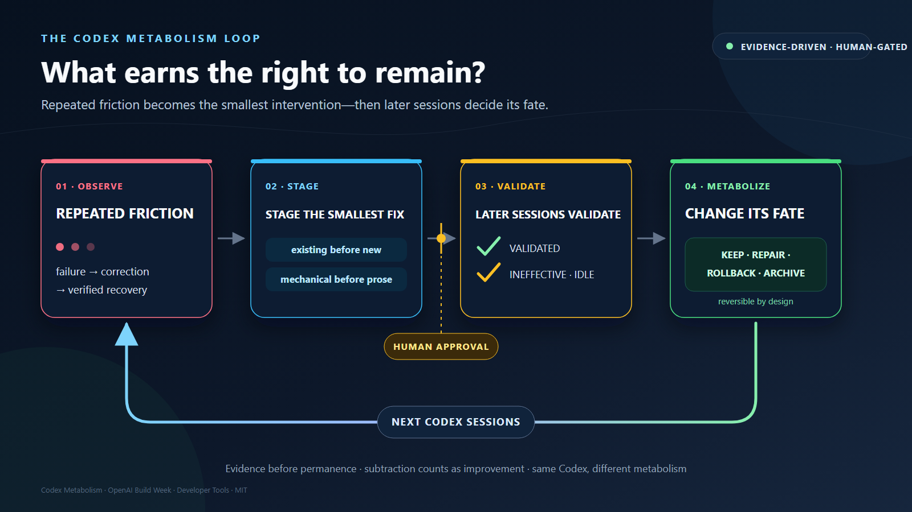

# OpenAI Build Week submission

## Submission fields

- **Project:** Codex Metabolism
- **Track:** Developer Tools
- **Tagline:** Turn repeated Codex mistakes into tested safeguards—and retire what stops helping.
- **One sentence:** Codex Metabolism finds recurring friction in Codex sessions, stages the smallest existing or new intervention across hooks, tools, skills, and bounded rules, then uses later sessions to keep, repair, roll back, or archive it.
- **Repository:** https://github.com/shihchengwei-lab/codex-metabolism
- **Demo video:** https://youtu.be/egZhaFeDkRE
- **Primary `/feedback` Session ID:** Entered in Devpost's organizer-only field; intentionally not repeated in this public repository.

## Devpost cover image

Editable source: [`assets/metabolism-loop.svg`](assets/metabolism-loop.svg). Use this as the first Devpost image; the more detailed judge-demo screenshot can follow it.

## Inspiration

OpenAI once documented a [literal goblin problem](https://openai.com/index/where-the-goblins-came-from/): Codex needed a developer-prompt instruction telling it, “Never talk about goblins.” The patch made sense—but how many rules in your `AGENTS.md` still solve a problem your recent sessions actually have?

Coding agents are excellent at adding memory, rules, skills, and tools. They are much worse at proving that an intervention still helps—or removing it when it no longer does. Our demo begins with two Codex sessions repeating the same failed deployment and user correction, while stale rules and an unused skill remain installed indefinitely. Accumulation is not improvement. The smallest reliable fix may be a test, hook, script, installed plugin, or existing open-source tool—not another paragraph of instructions.

Codex Metabolism is inspired by slime mold: explore candidate paths, reinforce those that carry useful traffic, validate them against future evidence, and withdraw structure that no longer earns its cost. The goal is a finite, auditable collaboration environment that becomes more personal and less frustrating over time.

Hermes Agent demonstrated agent-managed skill creation. Session-level retrospective tools demonstrated that trajectories contain more useful evidence than token totals. SkillReaper demonstrated evidence-based, reversible skill pruning. Codex Metabolism connects those ideas inside Codex and expands the unit of metabolism from “a skill” to the full collaboration intervention stack.

## What it does

`codex-metabolism review --days 7` streams recent Codex JSONL sessions, reports parser coverage, inventories installed skills and project tooling, evaluates active `AGENTS.md` scopes, and loads prior intervention receipts.

Before creating anything, it climbs five rungs: necessity, Codex built-ins, installed capabilities, repository assets, and the external open-source ecosystem. It emits only `CREATE`, `PATCH`, `KEEP`, or `RETIRE_CANDIDATE`, targeting one of four layers:

- `HARNESS` for mechanical prevention.
- `TOOL` for an existing installed or external capability.
- `SKILL` for contextual reusable workflows.
- `RULE` for bounded durable guidance.

All proposals are staged. Approved interventions receive a local ledger entry. Later sessions can validate them, show that friction recurred, or nominate an idle intervention for retirement. Active receipts suppress duplicate creation proposals, closing the loop instead of repeatedly rediscovering the same problem.

The operational loop no longer depends on remembering a weekly command. An opt-in native scheduler checks daily and launches a local, stage-only review after ten new sessions or seven days, whichever comes first; with no new sessions it records an idle heartbeat and does not analyze. Windows Task Scheduler, `launchd`, and a `systemd` user timer are supported. The heartbeat exposes missed checks, failures, backlog, and pending decisions, while live mutation remains human-approved.

The secondary public replay, `python examples/run_friction_cases_demo.py`, demonstrates that the router is not limited to deployment sequencing. One repeated correction adopts the reviewed `codlogs` tool instead of rebuilding a session explorer; another patches an existing `$ui-verification` skill after tests passed without rendered UI evidence. Neither correction is a command-order rule. The four public JSONL sessions are anonymized synthetic replays and the isolated run does not inspect the user's configured plugins.

Because clean fixtures can overstate robustness, `python examples/run_messy_evidence_demo.py` adds a six-session imperfect-data pressure test. Differently worded corrections, unrelated successes, a one-off recovery, repeated failures without verified recovery, a success in the wrong session, malformed JSONL, a high-star catalog distractor, and incomplete lifecycle evidence produce one evidence-backed decision, two explicit abstentions, one parser coverage warning, and zero unsafe retirement decisions. The non-actions are written to an inspectable challenge summary without adding an unsupported fifth decision type. Its CSV receives those already-computed abstentions explicitly; an ordinary `--export-evidence` review exports emitted decisions only. This remains a synthetic stress fixture, not a real-world quality benchmark, and it does not claim semantic clustering across paraphrased commands.

A separate 27-case detector boundary evaluation publishes the limitation instead of hiding it: eight supported positives are detected, eight semantic or parameter variants are missed, all eleven negatives abstain, and the resulting synthetic precision/recall are 1.000/0.500 with zero false positives. Three linguistic negatives verify that ordinary uses of `should`, `No`, `先`, and `應該` do not become invented corrections. It is explicitly not presented as real-user impact or causal validation. The public video shows the current 27-case suite.

`AGENTS.md` has a mixed-ownership boundary. The entire active document is evaluated, but only bytes between an existing valid `codex-metabolism:managed-start` / `managed-end` marker pair can be changed after explicit approval. Everything else remains recommendation-only. Full-file hashes, a ten-rule managed cap, and rollback protect the human-owned file.

## How we built it

- Python 3.11+ with a standard-library-only runtime.
- Streaming, bounded Codex JSONL parser with explicit coverage and conservative schema handling.
- Deterministic evidence and cross-layer routing engine.
- Five-rung existing-tool ladder and sanitized GitHub public search.
- Optional SkillReaper JSON adapter rather than rebuilding mature skill-lifecycle analysis.
- Whole-file `AGENTS.md` review with byte-preserving managed-region patches.
- Staging renderer for reports, diffs, hook proposals, skill changes, rules, and adoption plans.
- Intervention receipts plus later-session `VALIDATED`, `INEFFECTIVE`, and `IDLE_CANDIDATE` verdicts. New project hooks remain `PENDING_TRUST` until the user reviews them through Codex `/hooks` and confirms activation.
- Hash-gated apply, rollback, skill archive/restore, and manual external-tool activation/retirement recording.
- Optional GPT-5.6 second opinion through ephemeral, read-only `codex exec` with the verified `gpt-5.6-sol` model and a strict schema.
- Failing tests were written before each implementation slice.

## Challenges

Codex JSONL is useful but not a stable public analytics schema. The parser therefore reports coverage and treats parse gaps as unknown. Inspected versions did not expose a stable structured “this skill was invoked” event, so invocation remains explicitly heuristic.

Task success is not a single reliable label. Exit status and tests are harder signals; user corrections and inferred outcomes remain weaker. Codex Metabolism does not claim to know true quality from “the user did not complain.”

The ownership boundary was also subtle. A fully automatic `AGENTS.md` rewrite would be powerful but difficult to trust. The product instead evaluates the whole file, allows direct changes only in an explicit managed block, and preserves every byte outside it.

Finally, several open-source projects already solve parts of exploration, evolution, or pruning. The adoption ladder became both a product feature and our implementation discipline: integrate or adopt before building another tool.

The live advisor path also exposed two portability gaps that the deterministic demo could not: Windows resolved an npm `.cmd` launcher that Python could not execute directly, and Codex structured outputs reject JSON Schema `uniqueItems`. We added a shared, tested launcher for both the advisor and installed-plugin inventory, filtered marketplace entries that are not installed, moved duplicate-evidence enforcement into the local deterministic validator, and then reran the synthetic advisor successfully.

## Accomplishments

- The public demo replays two generations: repeated friction produces an intervention, two later successful sessions validate it, and duplicate creation is suppressed.
- A separate zero-install replay routes non-command-order friction to `PATCH TOOL` for existing-tool adoption and `PATCH SKILL` for visual-proof workflow repair.
- An imperfect-data pressure test produces one supported action, two visible non-actions, partial parser coverage, and no unsafe retirement proposal.
- One review spans mechanical harnesses, external tools, skills, and bounded `AGENTS.md` rules.
- A complete demo review produces harness creation, managed-rule pruning, skill retention, and a skill retirement candidate.
- Review never mutates live state.
- Managed `AGENTS.md` patches preserve bytes outside the marker region and can be rolled back exactly.
- External projects are proposed and tracked but never silently downloaded, installed, or deleted.
- Incomplete lifecycle or parser evidence cannot become a retirement claim.
- Retirement remains a human decision; local skills are archived and restorable.
- A real `gpt-5.6-sol` advisor run on the public fixtures completed in 48.5 seconds: it agreed with `CREATE HARNESS`, challenged a deterministic `PATCH RULE` with `KEEP RULE`, and remained visibly non-authoritative.

## What we learned

“Self-improving” is too vague. The useful boundary here is procedural collaboration context, not model weights. Improvement also needs subtraction: a system that only adds memory becomes harder to understand and trust.

The slime-mold analogy proved useful. The system grows a path only when repeated evidence justifies it, tests the path against future traffic, reinforces what works, and withdraws low-value structure. The key product object is therefore not a generated skill; it is the entire evidence-to-intervention-to-evaluation cycle.

## Demo video

The [public YouTube demo](https://youtu.be/egZhaFeDkRE) uses the 2:40 English voiceover, concrete first-14-second pain story, extended four-phase slime-mold sequence, verified live synthetic GPT-5.6 advisor result, and privacy-safe shot list specified in the [video production pack](DEMO_VIDEO.md). Timed [SRT captions](demo-voiceover.en.srt) are retained in the repository, and only synthetic data appears in the video.

## What's next

- Validate the streaming parser against additional documented Codex JSONL variants while preserving explicit coverage reporting.
- Add adapters for mature lifecycle and session tools instead of rebuilding their capabilities.
- Run longer opt-in evaluations to calibrate validation and retirement thresholds without treating silence as success.

## Submission checklist

The [OpenAI Build Week page](https://openai.devpost.com/) currently requires a working project using Codex with GPT-5.6, a category, project description, a public YouTube demo under three minutes with audio explaining both Codex and GPT-5.6 use, a testable repository URL with README and sample data, and the `/feedback` Codex Session ID for the session containing most core implementation. Developer tools also need installation instructions, supported platforms, and a judge-ready test path.

- [x] Working local project.
- [x] Developer Tools category selected in project copy.
- [x] Setup instructions and sample data.
- [x] One-command isolated two-generation demo.
- [x] Supported-platform status stated honestly.
- [x] Independent Linux + Python 3.12 clean-clone verification completed.
- [x] Codex/GPT-5.6 contribution and human decisions documented.
- [x] English voiceover script, timed captions, and privacy-safe shot list prepared.
- [x] Publish repository: https://github.com/shihchengwei-lab/codex-metabolism
- [x] Upload the rendered video to public YouTube: https://youtu.be/egZhaFeDkRE
- [x] Enter the `/feedback` Codex Session ID in the organizer-only field.
- [x] Submit the Devpost project form.

Submission status was confirmed on Devpost on **July 20, 2026**: `Submitted`, with `5/5 steps done`. The listed deadline remains **July 21, 2026 at 5:00 PM Pacific Time**.
